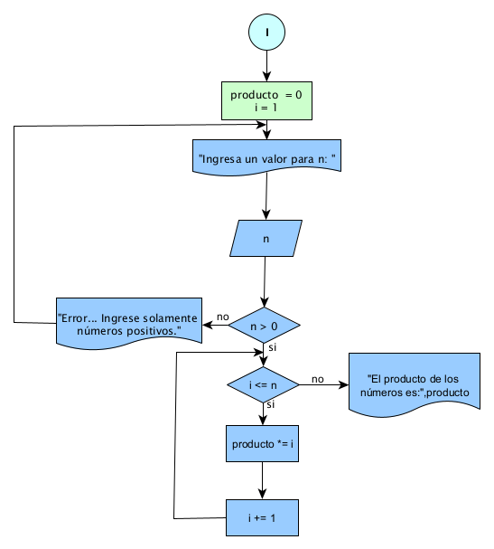
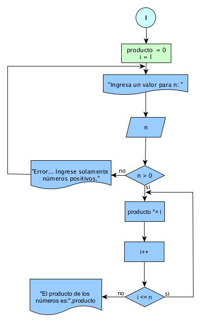
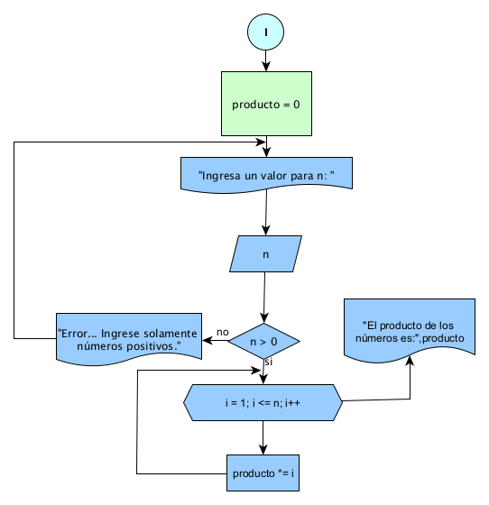

# Práctica 2

## Enunciado del Problema:
> π(i) desde i = 1 hasta n
Generar en while,do while ,for.

## Análisis:
> * Pedir el valor de n y verificar que sea positivo.
> * Inicializas una variable producto en 0.
> * Usas un bucle para repetir la variable hasta que se cumpla las condiciones.
> * Al final del bucle, el valor de producto contendrá el producto de n.

## Diagrama de Flujo de Datos (DFD):
**WHILE**

  

**DO WHILE**

  

**FOR**

  

## Prueba de Escritorio

<strong>WHILE</strong>

<table style="width:460.45pt;border-collapse:collapse;border:none;">
    <tbody>
        <tr>
            <td style="width: 31.95pt;border-top: none;border-left: 1pt solid windowtext;border-bottom: 1.5pt solid rgb(255, 217, 102);border-right: none;background: white;padding: 0cm 5.4pt;vertical-align: top;">
                
<strong>n</strong>

            </td>
            <td style="width: 21.15pt;border-top: none;border-right: none;border-left: none;border-image: initial;border-bottom: 1.5pt solid rgb(255, 217, 102);background: white;padding: 0cm 5.4pt;vertical-align: top;">
                
<strong>i</strong>

            </td>
            <td style="width: 65.15pt;border-top: none;border-right: none;border-left: none;border-image: initial;border-bottom: 1.5pt solid rgb(255, 217, 102);background: white;padding: 0cm 5.4pt;vertical-align: top;">
                
<strong>n &gt; 0</strong>

            </td>
            <td style="width: 89.75pt;border-top: none;border-right: none;border-left: none;border-image: initial;border-bottom: 1.5pt solid rgb(255, 217, 102);background: white;padding: 0cm 5.4pt;vertical-align: top;">
                
<strong>i &lt;= n</strong>

            </td>
            <td style="width: 62.8pt;border-top: none;border-right: none;border-left: none;border-image: initial;border-bottom: 1.5pt solid rgb(255, 217, 102);background: white;padding: 0cm 5.4pt;vertical-align: top;">
                
<strong>producto</strong>

            </td>
            <td style="width: 97.5pt;border-top: none;border-right: none;border-left: none;border-image: initial;border-bottom: 1.5pt solid rgb(255, 217, 102);background: white;padding: 0cm 5.4pt;vertical-align: top;">
                
<strong>producto *= i</strong>

            </td>
            <td style="width: 92.15pt;border-top: none;border-left: none;border-bottom: 1.5pt solid rgb(255, 217, 102);border-right: 1pt solid windowtext;background: white;padding: 0cm 5.4pt;vertical-align: top;">
                
<strong>i ++</strong>

            </td>
        </tr>
        <tr>
            <td style="width: 31.95pt;border-right: 1pt solid windowtext;border-bottom: 1pt solid windowtext;border-left: 1pt solid windowtext;border-image: initial;border-top: none;background: rgb(255, 242, 204);padding: 0cm 5.4pt;vertical-align: top;">
                
<strong>3</strong>

            </td>
            <td style="width: 21.15pt;border-top: none;border-left: none;border-bottom: 1pt solid windowtext;border-right: 1pt solid windowtext;background: rgb(255, 242, 204);padding: 0cm 5.4pt;vertical-align: top;">
                
1

            </td>
            <td style="width: 65.15pt;border-top: none;border-left: none;border-bottom: 1pt solid windowtext;border-right: 1pt solid windowtext;background: rgb(255, 242, 204);padding: 0cm 5.4pt;vertical-align: top;">
                
3 &gt; 0 True

            </td>
            <td style="width: 89.75pt;border-top: none;border-left: none;border-bottom: 1pt solid windowtext;border-right: 1pt solid windowtext;background: rgb(255, 242, 204);padding: 0cm 5.4pt;vertical-align: top;">
                
1 &lt;=3 True

                
2 &lt;=3 True

                
3 &lt;=3 True

                
4 &lt;=3 False

                
&nbsp;

            </td>
            <td style="width: 62.8pt;border-top: none;border-left: none;border-bottom: 1pt solid windowtext;border-right: 1pt solid windowtext;background: rgb(255, 242, 204);padding: 0cm 5.4pt;vertical-align: top;">
                
1

                
2

                
6

                
&nbsp;

            </td>
            <td style="width: 97.5pt;border-top: none;border-left: none;border-bottom: 1pt solid windowtext;border-right: 1pt solid windowtext;background: rgb(255, 242, 204);padding: 0cm 5.4pt;vertical-align: top;">
                
= 1(0+1)

                
= 2(1*2(1+1))

                
= 6(2*3(2+1))

                
&nbsp;

            </td>
            <td style="width: 92.15pt;border-top: none;border-left: none;border-bottom: 1pt solid windowtext;border-right: 1pt solid windowtext;background: rgb(255, 242, 204);padding: 0cm 5.4pt;vertical-align: top;">
                
i = 2 (1 +1)

                
i = 3 (2 +1)

                
i = 4 (3 +1)

                
&nbsp;

            </td>
        </tr>
    </tbody>
</table>

<strong>DO WHILE</strong>

<table style="width:453.35pt;border-collapse:collapse;border:none;">
    <tbody>
        <tr>
            <td style="width: 33.65pt;border-top: none;border-left: 1pt solid windowtext;border-bottom: 1.5pt solid rgb(255, 217, 102);border-right: none;background: white;padding: 0cm 5.4pt;vertical-align: top;">
                
<strong>n</strong>

            </td>
            <td style="width: 26.85pt;border-top: none;border-right: none;border-left: none;border-image: initial;border-bottom: 1.5pt solid rgb(255, 217, 102);background: white;padding: 0cm 5.4pt;vertical-align: top;">
                
<strong>i</strong>

            </td>
            <td style="width: 60.65pt;border-top: none;border-right: none;border-left: none;border-image: initial;border-bottom: 1.5pt solid rgb(255, 217, 102);background: white;padding: 0cm 5.4pt;vertical-align: top;">
                
<strong>n &gt; 0</strong>

            </td>
            <td style="width: 62.8pt;border-top: none;border-right: none;border-left: none;border-image: initial;border-bottom: 1.5pt solid rgb(255, 217, 102);background: white;padding: 0cm 5.4pt;vertical-align: top;">
                
<strong>producto</strong>

            </td>
            <td colspan="2" style="width: 135.75pt;border-top: none;border-right: none;border-left: none;border-image: initial;border-bottom: 1.5pt solid rgb(255, 217, 102);background: white;padding: 0cm 5.4pt;vertical-align: top;">
                
<strong>producto += i</strong>

            </td>
            <td style="width: 41.55pt;border-top: none;border-right: none;border-left: none;border-image: initial;border-bottom: 1.5pt solid rgb(255, 217, 102);background: white;padding: 0cm 5.4pt;vertical-align: top;">
                
<strong>i ++</strong>

            </td>
            <td style="width: 92.1pt;border-top: none;border-left: none;border-bottom: 1.5pt solid rgb(255, 217, 102);border-right: 1pt solid windowtext;background: white;padding: 0cm 5.4pt;vertical-align: top;">
                
<strong>i &lt;= n</strong>

            </td>
        </tr>
        <tr>
            <td style="width: 33.65pt;border-right: 1pt solid windowtext;border-bottom: 1pt solid windowtext;border-left: 1pt solid windowtext;border-image: initial;border-top: none;background: rgb(255, 242, 204);padding: 0cm 5.4pt;vertical-align: top;">
                
<strong>3</strong>

            </td>
            <td style="width: 26.85pt;border-top: none;border-left: none;border-bottom: 1pt solid windowtext;border-right: 1pt solid windowtext;background: rgb(255, 242, 204);padding: 0cm 5.4pt;vertical-align: top;">
                
1

            </td>
            <td style="width: 60.65pt;border-top: none;border-left: none;border-bottom: 1pt solid windowtext;border-right: 1pt solid windowtext;background: rgb(255, 242, 204);padding: 0cm 5.4pt;vertical-align: top;">
                
3 &gt; 0 True

            </td>
            <td style="width: 62.8pt;border-top: none;border-left: none;border-bottom: 1pt solid windowtext;border-right: 1pt solid windowtext;background: rgb(255, 242, 204);padding: 0cm 5.4pt;vertical-align: top;">
                
1

                
2

                
6

                
&nbsp;

            </td>
            <td style="width: 99.3pt;border-top: none;border-left: none;border-bottom: 1pt solid windowtext;border-right: 1pt solid windowtext;background: rgb(255, 242, 204);padding: 0cm 5.4pt;vertical-align: top;">
                
= 1(0+1)

                
= 2(1*2(1+1))

                
= 6(2*3(2+1))

                
&nbsp;

            </td>
            <td colspan="2" style="width: 78pt;border-top: none;border-left: none;border-bottom: 1pt solid windowtext;border-right: 1pt solid windowtext;background: rgb(255, 242, 204);padding: 0cm 5.4pt;vertical-align: top;">
                
i = 2 (1 +1)

                
i = 3 (2 +1)

                
i = 4 (3 +1)

                
&nbsp;

                
&nbsp;

            </td>
            <td style="width: 92.1pt;border-top: none;border-left: none;border-bottom: 1pt solid windowtext;border-right: 1pt solid windowtext;background: rgb(255, 242, 204);padding: 0cm 5.4pt;vertical-align: top;">
                
2 &lt;= 3 True

                
3 &lt;= 3 True

                
4 &lt;= 3 False

                
&nbsp;

            </td>
        </tr>
        <tr>
            <td style="border:none;"> </td>
            <td style="border:none;"> </td>
            <td style="border:none;"> </td>
            <td style="border:none;"> </td>
            <td style="border:none;"> </td>
            <td style="border:none;"> </td>
            <td style="border:none;"> </td>
            <td style="border:none;"> </td>
        </tr>
    </tbody>
</table>

<strong>FOR</strong>

<table style="width:410.85pt;border-collapse:collapse;border:none;">
    <tbody>
        <tr>
            <td style="width: 23.4pt;border-top: none;border-left: 1pt solid windowtext;border-bottom: 1.5pt solid rgb(255, 217, 102);border-right: none;background: white;padding: 0cm 5.4pt;height: 13.45pt;vertical-align: top;">
                
<strong>n</strong>

            </td>
            <td style="width: 62.5pt;border-top: none;border-right: none;border-left: none;border-image: initial;border-bottom: 1.5pt solid rgb(255, 217, 102);background: white;padding: 0cm 5.4pt;height: 13.45pt;vertical-align: top;">
                
<strong>n &gt; 0</strong>

            </td>
            <td style="width: 169.5pt;border-top: none;border-right: none;border-left: none;border-image: initial;border-bottom: 1.5pt solid rgb(255, 217, 102);background: white;padding: 0cm 5.4pt;height: 13.45pt;vertical-align: top;">
                
<strong>i = 1; i &lt;= n; i += 1</strong>

            </td>
            <td style="width: 62.8pt;border-top: none;border-right: none;border-left: none;border-image: initial;border-bottom: 1.5pt solid rgb(255, 217, 102);background: white;padding: 0cm 5.4pt;height: 13.45pt;vertical-align: top;">
                
<strong>producto</strong>

            </td>
            <td style="width: 92.65pt;border-top: none;border-left: none;border-bottom: 1.5pt solid rgb(255, 217, 102);border-right: 1pt solid windowtext;background: white;padding: 0cm 5.4pt;height: 13.45pt;vertical-align: top;">
                
<strong>producto +=&nbsp;</strong><strong>i</strong>

            </td>
        </tr>
        <tr>
            <td style="width: 23.4pt;border-right: 1pt solid windowtext;border-bottom: 1pt solid windowtext;border-left: 1pt solid windowtext;border-image: initial;border-top: none;background: rgb(255, 242, 204);padding: 0cm 5.4pt;height: 78.8pt;vertical-align: top;">
                
<strong>3</strong>

            </td>
            <td style="width: 62.5pt;border-top: none;border-left: none;border-bottom: 1pt solid windowtext;border-right: 1pt solid windowtext;background: rgb(255, 242, 204);padding: 0cm 5.4pt;height: 78.8pt;vertical-align: top;">
                
3 &gt; 0 True

            </td>
            <td style="width: 169.5pt;border-top: none;border-left: none;border-bottom: 1pt solid windowtext;border-right: 1pt solid windowtext;background: rgb(255, 242, 204);padding: 0cm 5.4pt;height: 78.8pt;vertical-align: top;">
                
i = 1; 1 &lt;=3; i +=1 True

                
&nbsp; &nbsp; &nbsp; &nbsp; &nbsp; 2 &lt;=3; i = 2 (1 +1) True

                
&nbsp; &nbsp; &nbsp; &nbsp; &nbsp; 3 &lt;=3; i = 3 (2 +1) True

                
&nbsp; &nbsp; &nbsp; &nbsp; &nbsp; 4 &lt;=3 False

                
&nbsp;

                
&nbsp;

            </td>
            <td style="width: 62.8pt;border-top: none;border-left: none;border-bottom: 1pt solid windowtext;border-right: 1pt solid windowtext;background: rgb(255, 242, 204);padding: 0cm 5.4pt;height: 78.8pt;vertical-align: top;">
                
1

                
2

                
6

                
&nbsp;

            </td>
            <td style="width: 92.65pt;border-top: none;border-left: none;border-bottom: 1pt solid windowtext;border-right: 1pt solid windowtext;background: rgb(255, 242, 204);padding: 0cm 5.4pt;height: 78.8pt;vertical-align: top;">
                
= 1(0+1)

                
= 2(1*2(1+1))

                
= 6(2*3(2+1))

                
&nbsp;

                
&nbsp;

            </td>
        </tr>
    </tbody>
</table>

&nbsp;

## Ejecución

  

