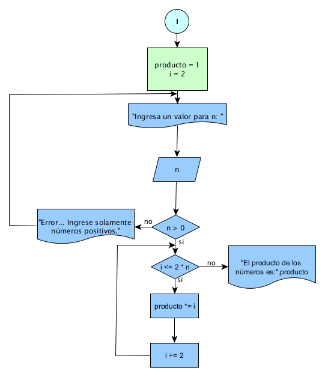
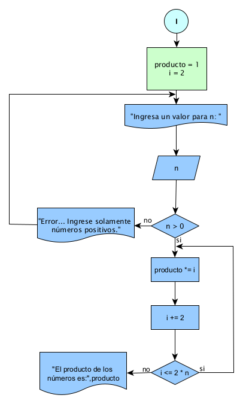

# Práctica 3

## Enunciado del Problema:
> π(i) desde i = 2 hasta 2n
Generar en while,do while ,for.

## Análisis:
> * Pedir el valor de 2n y verificar que sea positivo.
> * Inicializas una variable producto en 0.
> * Usas un bucle para repetir la variable hasta que se cumpla las condiciones.
> * Al final del bucle, el valor de producto contendrá el producto de 2n.

## Diagrama de Flujo de Datos (DFD):
**WHILE**

  

**DO WHILE**

  

**FOR**

  

## Prueba de Escritorio

<strong>WHILE</strong>

<table style="width:425.0pt;border-collapse:collapse;border:none;">
    <tbody>
        <tr>
            <td style="width: 23.85pt;border-top: none;border-left: 1pt solid windowtext;border-bottom: 1.5pt solid rgb(255, 217, 102);border-right: none;background: white;padding: 0cm 5.4pt;vertical-align: top;">
                
<strong>n</strong>

            </td>
            <td style="width: 19.05pt;border-top: none;border-right: none;border-left: none;border-image: initial;border-bottom: 1.5pt solid rgb(255, 217, 102);background: white;padding: 0cm 5.4pt;vertical-align: top;">
                
<strong>i</strong>

            </td>
            <td style="width: 47.5pt;border-top: none;border-right: none;border-left: none;border-image: initial;border-bottom: 1.5pt solid rgb(255, 217, 102);background: white;padding: 0cm 5.4pt;vertical-align: top;">
                
<strong>n &gt; 0</strong>

            </td>
            <td style="width: 94pt;border-top: none;border-right: none;border-left: none;border-image: initial;border-bottom: 1.5pt solid rgb(255, 217, 102);background: white;padding: 0cm 5.4pt;vertical-align: top;">
                
<strong>i &lt;= 2 * n</strong>

            </td>
            <td style="width: 63.5pt;border-top: none;border-right: none;border-left: none;border-image: initial;border-bottom: 1.5pt solid rgb(255, 217, 102);background: white;padding: 0cm 5.4pt;vertical-align: top;">
                
<strong>Producto</strong>

            </td>
            <td style="width: 106.25pt;border-top: none;border-right: none;border-left: none;border-image: initial;border-bottom: 1.5pt solid rgb(255, 217, 102);background: white;padding: 0cm 5.4pt;vertical-align: top;">
                
<strong>producto *= i</strong>

            </td>
            <td style="width: 70.85pt;border-top: none;border-left: none;border-bottom: 1.5pt solid rgb(255, 217, 102);border-right: 1pt solid windowtext;background: white;padding: 0cm 5.4pt;vertical-align: top;">
                
<strong>i += 2</strong>

            </td>
        </tr>
        <tr>
            <td style="width: 23.85pt;border-right: 1pt solid windowtext;border-bottom: 1pt solid windowtext;border-left: 1pt solid windowtext;border-image: initial;border-top: none;background: rgb(255, 242, 204);padding: 0cm 5.4pt;vertical-align: top;">
                
<strong>3</strong>

            </td>
            <td style="width: 19.05pt;border-top: none;border-left: none;border-bottom: 1pt solid windowtext;border-right: 1pt solid windowtext;background: rgb(255, 242, 204);padding: 0cm 5.4pt;vertical-align: top;">
                
2

            </td>
            <td style="width: 47.5pt;border-top: none;border-left: none;border-bottom: 1pt solid windowtext;border-right: 1pt solid windowtext;background: rgb(255, 242, 204);padding: 0cm 5.4pt;vertical-align: top;">
                
3 &gt; 0 True

            </td>
            <td style="width: 94pt;border-top: none;border-left: none;border-bottom: 1pt solid windowtext;border-right: 1pt solid windowtext;background: rgb(255, 242, 204);padding: 0cm 5.4pt;vertical-align: top;">
                
2 &lt;=2 * 3 True

                
4 &lt;=2 * 3 True

                
6 &lt;=2 * 3 True

                
12 &lt;=2 * 3 False

                
&nbsp;

            </td>
            <td style="width: 63.5pt;border-top: none;border-left: none;border-bottom: 1pt solid windowtext;border-right: 1pt solid windowtext;background: rgb(255, 242, 204);padding: 0cm 5.4pt;vertical-align: top;">
                
0

                
2

                
8

                
48

            </td>
            <td style="width: 106.25pt;border-top: none;border-left: none;border-bottom: 1pt solid windowtext;border-right: 1pt solid windowtext;background: rgb(255, 242, 204);padding: 0cm 5.4pt;vertical-align: top;">
                
=2 (0 + 2)

                
=8(2*4 (2 + 2))

                
=48(6 * 8(4 + 2))

            </td>
            <td style="width: 70.85pt;border-top: none;border-left: none;border-bottom: 1pt solid windowtext;border-right: 1pt solid windowtext;background: rgb(255, 242, 204);padding: 0cm 5.4pt;vertical-align: top;">
                
i = 4 (2+2)

                
i = 6 (2+4)

                
i = 12(6+6)

                
&nbsp;

            </td>
        </tr>
    </tbody>
</table>

<strong>DO WHILE</strong>

<table style="width:439.2pt;border-collapse:collapse;border:none;">
    <tbody>
        <tr>
            <td style="width: 21.05pt;border-top: none;border-left: 1pt solid windowtext;border-bottom: 1.5pt solid rgb(255, 217, 102);border-right: none;background: white;padding: 0cm 5.4pt;vertical-align: top;">
                
<strong>n</strong>

            </td>
            <td style="width: 21.25pt;border-top: none;border-right: none;border-left: none;border-image: initial;border-bottom: 1.5pt solid rgb(255, 217, 102);background: white;padding: 0cm 5.4pt;vertical-align: top;">
                
<strong>i</strong>

            </td>
            <td style="width: 42.5pt;border-top: none;border-right: none;border-left: none;border-image: initial;border-bottom: 1.5pt solid rgb(255, 217, 102);background: white;padding: 0cm 5.4pt;vertical-align: top;">
                
<strong>n &gt; 0</strong>

            </td>
            <td style="width: 63.8pt;border-top: none;border-right: none;border-left: none;border-image: initial;border-bottom: 1.5pt solid rgb(255, 217, 102);background: white;padding: 0cm 5.4pt;vertical-align: top;">
                
<strong>producto</strong>

            </td>
            <td style="width: 4cm;border-top: none;border-right: none;border-left: none;border-image: initial;border-bottom: 1.5pt solid rgb(255, 217, 102);background: white;padding: 0cm 5.4pt;vertical-align: top;">
                
<strong>producto *= i</strong>

            </td>
            <td style="width: 3cm;border-top: none;border-right: none;border-left: none;border-image: initial;border-bottom: 1.5pt solid rgb(255, 217, 102);background: white;padding: 0cm 5.4pt;vertical-align: top;">
                
<strong>i += 2</strong>

            </td>
            <td style="width: 92.15pt;border-top: none;border-left: none;border-bottom: 1.5pt solid rgb(255, 217, 102);border-right: 1pt solid windowtext;background: white;padding: 0cm 5.4pt;vertical-align: top;">
                
<strong>i &lt;= 2 * n</strong>

            </td>
        </tr>
        <tr>
            <td style="width: 21.05pt;border-right: 1pt solid windowtext;border-bottom: 1pt solid windowtext;border-left: 1pt solid windowtext;border-image: initial;border-top: none;background: rgb(255, 242, 204);padding: 0cm 5.4pt;vertical-align: top;">
                
<strong>3</strong>

            </td>
            <td style="width: 21.25pt;border-top: none;border-left: none;border-bottom: 1pt solid windowtext;border-right: 1pt solid windowtext;background: rgb(255, 242, 204);padding: 0cm 5.4pt;vertical-align: top;">
                
2

            </td>
            <td style="width: 42.5pt;border-top: none;border-left: none;border-bottom: 1pt solid windowtext;border-right: 1pt solid windowtext;background: rgb(255, 242, 204);padding: 0cm 5.4pt;vertical-align: top;">
                
3 &gt; 0 True

            </td>
            <td style="width: 63.8pt;border-top: none;border-left: none;border-bottom: 1pt solid windowtext;border-right: 1pt solid windowtext;background: rgb(255, 242, 204);padding: 0cm 5.4pt;vertical-align: top;">
                
0

                
2

                
8

                
48

            </td>
            <td style="width: 4cm;border-top: none;border-left: none;border-bottom: 1pt solid windowtext;border-right: 1pt solid windowtext;background: rgb(255, 242, 204);padding: 0cm 5.4pt;vertical-align: top;">
                
=2 (0 + 2)

                
=8(2*4 (2 + 2))

                
=48(6 * 8(4 + 2))

            </td>
            <td style="width: 3cm;border-top: none;border-left: none;border-bottom: 1pt solid windowtext;border-right: 1pt solid windowtext;background: rgb(255, 242, 204);padding: 0cm 5.4pt;vertical-align: top;">
                
i = 4 (2+2)

                
i = 6 (2+4)

                
i = 12(6+6)

                
&nbsp;

            </td>
            <td style="width: 92.15pt;border-top: none;border-left: none;border-bottom: 1pt solid windowtext;border-right: 1pt solid windowtext;background: rgb(255, 242, 204);padding: 0cm 5.4pt;vertical-align: top;">
                
2 &lt;=2 * 3 True

                
4 &lt;=2 * 3 True

                
6 &lt;=2 * 3 True

                
12 &lt;=2 * 3 False

                
&nbsp;

            </td>
        </tr>
    </tbody>
</table>

<strong>FOR</strong>

<table style="width:433.45pt;border-collapse:collapse;border:none;">
    <tbody>
        <tr>
            <td style="width: 24.65pt;border-top: none;border-left: 1pt solid windowtext;border-bottom: 1.5pt solid rgb(255, 217, 102);border-right: none;background: white;padding: 0cm 5.4pt;height: 13.45pt;vertical-align: top;">
                
<strong>n</strong>

            </td>
            <td style="width: 69pt;border-top: none;border-right: none;border-left: none;border-image: initial;border-bottom: 1.5pt solid rgb(255, 217, 102);background: white;padding: 0cm 5.4pt;height: 13.45pt;vertical-align: top;">
                
<strong>n &gt; 0</strong>

            </td>
            <td style="width: 191.4pt;border-top: none;border-right: none;border-left: none;border-image: initial;border-bottom: 1.5pt solid rgb(255, 217, 102);background: white;padding: 0cm 5.4pt;height: 13.45pt;vertical-align: top;">
                
<strong>i = 2; i &lt;= 2 * n; i += 2</strong>

            </td>
            <td style="width: 42.15pt;border-top: none;border-right: none;border-left: none;border-image: initial;border-bottom: 1.5pt solid rgb(255, 217, 102);background: white;padding: 0cm 5.4pt;height: 13.45pt;vertical-align: top;">
                
<strong>producto</strong>

            </td>
            <td style="width: 106.25pt;border-top: none;border-left: none;border-bottom: 1.5pt solid rgb(255, 217, 102);border-right: 1pt solid windowtext;background: white;padding: 0cm 5.4pt;height: 13.45pt;vertical-align: top;">
                
<strong>producto *= i</strong>

            </td>
        </tr>
        <tr>
            <td style="width: 24.65pt;border-right: 1pt solid windowtext;border-bottom: 1pt solid windowtext;border-left: 1pt solid windowtext;border-image: initial;border-top: none;background: rgb(255, 242, 204);padding: 0cm 5.4pt;height: 78.8pt;vertical-align: top;">
                
<strong>3</strong>

            </td>
            <td style="width: 69pt;border-top: none;border-left: none;border-bottom: 1pt solid windowtext;border-right: 1pt solid windowtext;background: rgb(255, 242, 204);padding: 0cm 5.4pt;height: 78.8pt;vertical-align: top;">
                
3 &gt; 0 True

            </td>
            <td style="width: 191.4pt;border-top: none;border-left: none;border-bottom: 1pt solid windowtext;border-right: 1pt solid windowtext;background: rgb(255, 242, 204);padding: 0cm 5.4pt;height: 78.8pt;vertical-align: top;">
                
i = 2; 2 &lt;=2 * 3; i = 4 (2+2) True

                
&nbsp; &nbsp; &nbsp; &nbsp; &nbsp; 4 &lt;=2 * 3; i = 6(2+4) True

                
&nbsp; &nbsp; &nbsp; &nbsp; &nbsp; 6 &lt;=2 * 3; i = 12 (6+6) True

                
&nbsp; &nbsp; &nbsp; &nbsp; &nbsp; 12 &lt;=2 * 3 False

                
&nbsp;

                
&nbsp;

            </td>
            <td style="width: 42.15pt;border-top: none;border-left: none;border-bottom: 1pt solid windowtext;border-right: 1pt solid windowtext;background: rgb(255, 242, 204);padding: 0cm 5.4pt;height: 78.8pt;vertical-align: top;">
                
0

                
2

                
8

                
48

            </td>
            <td style="width: 106.25pt;border-top: none;border-left: none;border-bottom: 1pt solid windowtext;border-right: 1pt solid windowtext;background: rgb(255, 242, 204);padding: 0cm 5.4pt;height: 78.8pt;vertical-align: top;">
                
=2 (0 + 2)

                
=6 (2 + 4)

                
=12 (6 + 6)

            </td>
        </tr>
    </tbody>
</table>

&nbsp;

## Ejecución

  

