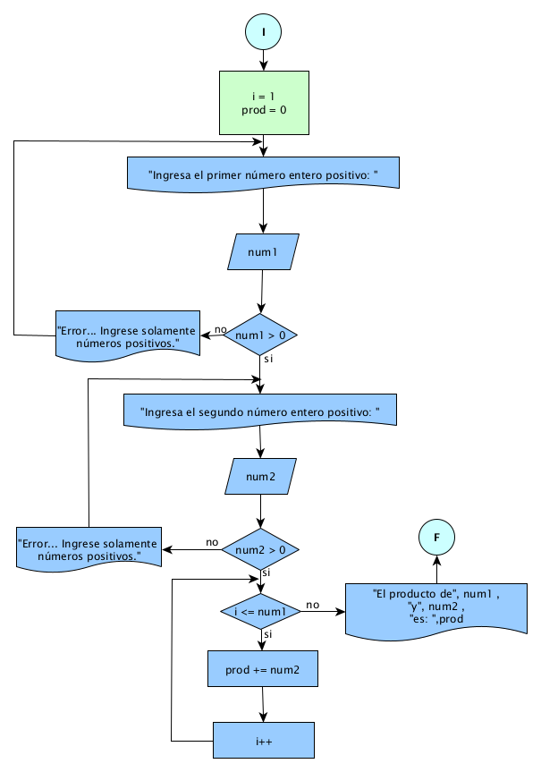
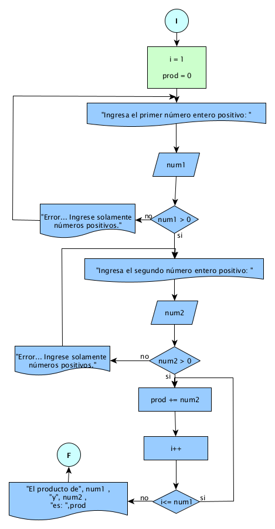
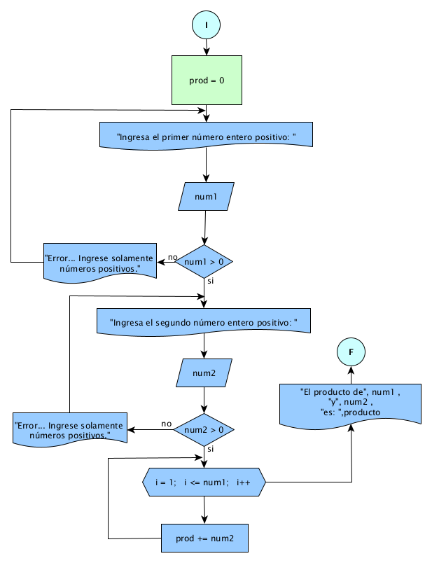
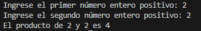

# Práctica 5

## Enunciado del Problema:
> Obtener el producto de dos números enteros positivos mediante sumas sucesivas.

## Análisis:
> * Leer dos números enteros positivos, n1 y n2.
> * Inicializas una variable producto en 0.
> * Usas un bucle para repetir la suma de n1 en producto exactamente n2 veces.
> * Al final del bucle, el valor de producto contendrá el producto de los dos números.

## Diagrama de Flujo de Datos (DFD):
**WHILE**

  

**DO WHILE**

  

**FOR**

  

## Prueba de Escritorio
<table style="float: left;border-collapse:collapse;border:none;margin-left:4.8pt;margin-right:4.8pt;">
    <tbody>
        <tr>
            <td style="width: 43.05pt;border-top: none;border-right: none;border-left: none;border-image: initial;border-bottom: 1.5pt solid rgb(255, 217, 102);background: white;padding: 0cm 5.4pt;vertical-align: top;">
                
<strong>i</strong>

            </td>
            <td style="width: 54.2pt;border-top: none;border-right: none;border-left: none;border-image: initial;border-bottom: 1.5pt solid rgb(255, 217, 102);background: white;padding: 0cm 5.4pt;vertical-align: top;">
                
<strong>num1&nbsp;</strong>

            </td>
            <td style="width: 59.05pt;border-top: none;border-right: none;border-left: none;border-image: initial;border-bottom: 1.5pt solid rgb(255, 217, 102);background: white;padding: 0cm 5.4pt;vertical-align: top;">
                
<strong>num1&gt;0</strong>

            </td>
            <td style="width: 46.85pt;border-top: none;border-right: none;border-left: none;border-image: initial;border-bottom: 1.5pt solid rgb(255, 217, 102);background: white;padding: 0cm 5.4pt;vertical-align: top;">
                
<strong>num2</strong>

            </td>
            <td style="width: 55.15pt;border-top: none;border-right: none;border-left: none;border-image: initial;border-bottom: 1.5pt solid rgb(255, 217, 102);background: white;padding: 0cm 5.4pt;vertical-align: top;">
                
<strong>num2&gt;0</strong>

            </td>
            <td style="width: 71.6pt;border-top: none;border-right: none;border-left: none;border-image: initial;border-bottom: 1.5pt solid rgb(255, 217, 102);background: white;padding: 0cm 5.4pt;vertical-align: top;">
                
<strong>i&lt;=num2</strong>

            </td>
            <td style="width: 54.2pt;border-top: none;border-right: none;border-left: none;border-image: initial;border-bottom: 1.5pt solid rgb(255, 217, 102);background: white;padding: 0cm 5.4pt;vertical-align: top;">
                
<strong>prod += num2</strong>

            </td>
            <td style="width: 57.8pt;border-top: none;border-right: none;border-left: none;border-image: initial;border-bottom: 1.5pt solid rgb(255, 217, 102);background: white;padding: 0cm 5.4pt;vertical-align: top;">
                
<strong>i++</strong>

            </td>
        </tr>
        <tr>
            <td style="width: 43.05pt;border-top: none;border-left: none;border-bottom: 1pt solid rgb(255, 217, 102);border-right: 1pt solid rgb(255, 217, 102);background: rgb(255, 242, 204);padding: 0cm 5.4pt;vertical-align: top;">
                
<strong>1</strong>

            </td>
            <td style="width: 54.2pt;border-top: none;border-left: none;border-bottom: 1pt solid rgb(255, 217, 102);border-right: 1pt solid rgb(255, 217, 102);background: rgb(255, 242, 204);padding: 0cm 5.4pt;vertical-align: top;">
                
2

            </td>
            <td style="width: 59.05pt;border-top: none;border-left: none;border-bottom: 1pt solid rgb(255, 217, 102);border-right: 1pt solid rgb(255, 217, 102);background: rgb(255, 242, 204);padding: 0cm 5.4pt;vertical-align: top;">
                
2&gt;0 True

            </td>
            <td style="width: 46.85pt;border-top: none;border-left: none;border-bottom: 1pt solid rgb(255, 217, 102);border-right: 1pt solid rgb(255, 217, 102);background: rgb(255, 242, 204);padding: 0cm 5.4pt;vertical-align: top;">
                
2

            </td>
            <td style="width: 55.15pt;border-top: none;border-left: none;border-bottom: 1pt solid rgb(255, 217, 102);border-right: 1pt solid rgb(255, 217, 102);background: rgb(255, 242, 204);padding: 0cm 5.4pt;vertical-align: top;">
                
2&gt;0 True

            </td>
            <td style="width: 71.6pt;border-top: none;border-left: none;border-bottom: 1pt solid rgb(255, 217, 102);border-right: 1pt solid rgb(255, 217, 102);background: rgb(255, 242, 204);padding: 0cm 5.4pt;vertical-align: top;">
                
1 &lt;= 2 True

                
2 &lt;= 2 True

                
3 &lt;=2 False

            </td>
            <td style="width: 54.2pt;border-top: none;border-left: none;border-bottom: 1pt solid rgb(255, 217, 102);border-right: 1pt solid rgb(255, 217, 102);background: rgb(255, 242, 204);padding: 0cm 5.4pt;vertical-align: top;">
                
= 0 +2

                
= 4(2 + 2)

            </td>
            <td style="width: 57.8pt;border-top: none;border-right: none;border-left: none;border-image: initial;border-bottom: 1pt solid rgb(255, 217, 102);background: rgb(255, 242, 204);padding: 0cm 5.4pt;vertical-align: top;">
                
=2(1+1)

                
=3(2+1)

            </td>
        </tr>
    </tbody>
</table>

<strong>WHILE</strong>

<strong>DO WHILE</strong>

<table style="border-collapse:collapse;border:none;">
    <tbody>
        <tr>
            <td style="width: 56pt;border-top: none;border-right: none;border-left: none;border-image: initial;border-bottom: 1.5pt solid rgb(255, 217, 102);background: white;padding: 0cm 5.4pt;vertical-align: top;">
                
<strong>num1&nbsp;</strong>

            </td>
            <td style="width: 59.85pt;border-top: none;border-right: none;border-left: none;border-image: initial;border-bottom: 1.5pt solid rgb(255, 217, 102);background: white;padding: 0cm 5.4pt;vertical-align: top;">
                
<strong>num1&gt;0</strong>

            </td>
            <td style="width: 47.75pt;border-top: none;border-right: none;border-left: none;border-image: initial;border-bottom: 1.5pt solid rgb(255, 217, 102);background: white;padding: 0cm 5.4pt;vertical-align: top;">
                
<strong>num2</strong>

            </td>
            <td style="width: 55.45pt;border-top: none;border-right: none;border-left: none;border-image: initial;border-bottom: 1.5pt solid rgb(255, 217, 102);background: white;padding: 0cm 5.4pt;vertical-align: top;">
                
<strong>num2&gt;0</strong>

            </td>
            <td style="width: 56pt;border-top: none;border-right: none;border-left: none;border-image: initial;border-bottom: 1.5pt solid rgb(255, 217, 102);background: white;padding: 0cm 5.4pt;vertical-align: top;">
                
<strong>prod += num2</strong>

            </td>
            <td style="width: 47.05pt;border-top: none;border-right: none;border-left: none;border-image: initial;border-bottom: 1.5pt solid rgb(255, 217, 102);background: white;padding: 0cm 5.4pt;vertical-align: top;">
                
<strong>i</strong>

            </td>
            <td style="width: 58.85pt;border-top: none;border-right: none;border-left: none;border-image: initial;border-bottom: 1.5pt solid rgb(255, 217, 102);background: white;padding: 0cm 5.4pt;vertical-align: top;">
                
<strong>i++</strong>

            </td>
            <td style="width: 60.95pt;border-top: none;border-right: none;border-left: none;border-image: initial;border-bottom: 1.5pt solid rgb(255, 217, 102);background: white;padding: 0cm 5.4pt;vertical-align: top;">
                
<strong>i&lt;=num2</strong>

            </td>
        </tr>
        <tr>
            <td style="width: 56pt;border-top: none;border-left: none;border-bottom: 1pt solid rgb(255, 217, 102);border-right: 1pt solid rgb(255, 217, 102);background: rgb(255, 242, 204);padding: 0cm 5.4pt;vertical-align: top;">
                
<strong>2</strong>

            </td>
            <td style="width: 59.85pt;border-top: none;border-left: none;border-bottom: 1pt solid rgb(255, 217, 102);border-right: 1pt solid rgb(255, 217, 102);background: rgb(255, 242, 204);padding: 0cm 5.4pt;vertical-align: top;">
                
2&gt;0 True

            </td>
            <td style="width: 47.75pt;border-top: none;border-left: none;border-bottom: 1pt solid rgb(255, 217, 102);border-right: 1pt solid rgb(255, 217, 102);background: rgb(255, 242, 204);padding: 0cm 5.4pt;vertical-align: top;">
                
2

            </td>
            <td style="width: 55.45pt;border-top: none;border-left: none;border-bottom: 1pt solid rgb(255, 217, 102);border-right: 1pt solid rgb(255, 217, 102);background: rgb(255, 242, 204);padding: 0cm 5.4pt;vertical-align: top;">
                
2&gt;0 True

            </td>
            <td style="width: 56pt;border-top: none;border-left: none;border-bottom: 1pt solid rgb(255, 217, 102);border-right: 1pt solid rgb(255, 217, 102);background: rgb(255, 242, 204);padding: 0cm 5.4pt;vertical-align: top;">
                
= 0 +2

                
= 4(2 + 2)

            </td>
            <td style="width: 47.05pt;border-top: none;border-left: none;border-bottom: 1pt solid rgb(255, 217, 102);border-right: 1pt solid rgb(255, 217, 102);background: rgb(255, 242, 204);padding: 0cm 5.4pt;vertical-align: top;">
                
1

            </td>
            <td style="width: 58.85pt;border-top: none;border-left: none;border-bottom: 1pt solid rgb(255, 217, 102);border-right: 1pt solid rgb(255, 217, 102);background: rgb(255, 242, 204);padding: 0cm 5.4pt;vertical-align: top;">
                
=2(1+1)

                
=3(2+1)

            </td>
            <td style="width: 60.95pt;border-top: none;border-right: none;border-left: none;border-image: initial;border-bottom: 1pt solid rgb(255, 217, 102);background: rgb(255, 242, 204);padding: 0cm 5.4pt;vertical-align: top;">
                
1 &lt;= 2 True

                
2 &lt;= 2 True

                
3 &lt;=2 False

            </td>
        </tr>
    </tbody>
</table>

<strong>FOR</strong>

<table style="border-collapse:collapse;border:none;">
    <tbody>
        <tr>
            <td style="width: 48.6pt;border-top: none;border-right: none;border-left: none;border-image: initial;border-bottom: 1.5pt solid rgb(255, 217, 102);background: white;padding: 0cm 5.4pt;vertical-align: top;">
                
<strong>num1&nbsp;</strong>

            </td>
            <td style="width: 56.5pt;border-top: none;border-right: none;border-left: none;border-image: initial;border-bottom: 1.5pt solid rgb(255, 217, 102);background: white;padding: 0cm 5.4pt;vertical-align: top;">
                
<strong>num1&gt;0</strong>

            </td>
            <td style="width: 44.2pt;border-top: none;border-right: none;border-left: none;border-image: initial;border-bottom: 1.5pt solid rgb(255, 217, 102);background: white;padding: 0cm 5.4pt;vertical-align: top;">
                
<strong>num2</strong>

            </td>
            <td style="width: 63.35pt;border-top: none;border-right: none;border-left: none;border-image: initial;border-bottom: 1.5pt solid rgb(255, 217, 102);background: white;padding: 0cm 5.4pt;vertical-align: top;">
                
<strong>num2&gt;0</strong>

            </td>
            <td style="width: 127.55pt;border-top: none;border-right: none;border-left: none;border-image: initial;border-bottom: 1.5pt solid rgb(255, 217, 102);background: white;padding: 0cm 5.4pt;vertical-align: top;">
                
<strong>i = 1; &nbsp; i &lt;= num1; &nbsp; i++</strong>

            </td>
            <td style="width: 92.15pt;border-top: none;border-right: none;border-left: none;border-image: initial;border-bottom: 1.5pt solid rgb(255, 217, 102);background: white;padding: 0cm 5.4pt;vertical-align: top;">
                
<strong>prod += num2</strong>

            </td>
        </tr>
        <tr>
            <td style="width: 48.6pt;border-top: none;border-left: none;border-bottom: 1pt solid rgb(255, 217, 102);border-right: 1pt solid rgb(255, 217, 102);background: rgb(255, 242, 204);padding: 0cm 5.4pt;vertical-align: top;">
                
<strong>2</strong>

            </td>
            <td style="width: 56.5pt;border-top: none;border-left: none;border-bottom: 1pt solid rgb(255, 217, 102);border-right: 1pt solid rgb(255, 217, 102);background: rgb(255, 242, 204);padding: 0cm 5.4pt;vertical-align: top;">
                
2&gt;0 True

            </td>
            <td style="width: 44.2pt;border-top: none;border-left: none;border-bottom: 1pt solid rgb(255, 217, 102);border-right: 1pt solid rgb(255, 217, 102);background: rgb(255, 242, 204);padding: 0cm 5.4pt;vertical-align: top;">
                
2

            </td>
            <td style="width: 63.35pt;border-top: none;border-left: none;border-bottom: 1pt solid rgb(255, 217, 102);border-right: 1pt solid rgb(255, 217, 102);background: rgb(255, 242, 204);padding: 0cm 5.4pt;vertical-align: top;">
                
2&gt;0 True

            </td>
            <td style="width: 127.55pt;border-top: none;border-left: none;border-bottom: 1pt solid rgb(255, 217, 102);border-right: 1pt solid rgb(255, 217, 102);background: rgb(255, 242, 204);padding: 0cm 5.4pt;vertical-align: top;">
                
i=1;1 &lt;= 2; 2(1+1) True

                
&nbsp; &nbsp; &nbsp; 2 &lt;= 2; 3(2+1) True

                
&nbsp; &nbsp; &nbsp; 3 &lt;=2 False

            </td>
            <td style="width: 92.15pt;border-top: none;border-right: none;border-left: none;border-image: initial;border-bottom: 1pt solid rgb(255, 217, 102);background: rgb(255, 242, 204);padding: 0cm 5.4pt;vertical-align: top;">
                
= 0 +2

                
= 4(2 + 2)

            </td>
        </tr>
    </tbody>
</table>

&nbsp;

## Ejecución

  

